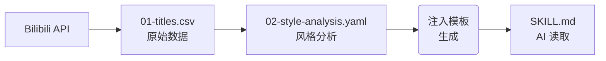

# 黑鸦 · 标题风格生成器

[](LICENSE)
[](https://agentskills.io)
[](https://www.skills.sh/chouchiu/heya-skill)
[](https://skills.sh/chouchiu/heya-skill)


基于 B 站博主 **[黑鸦](https://space.bilibili.com/3706929260006322)**（Heya）视频标题的深度分析，让 AI 学会黑鸦的标志性风格：**长标题、情绪炸弹、多事件合并**。

兼容 [Agent Skills](https://agentskills.io) 协议，支持 Claude Code、Codex、Cursor、OpenClaw、Gemini CLI、OpenCode 等 runtime。

## 特性

通过采集 B 站黑鸦的真实视频标题并进行统计分析，让 AI agent 学会其风格并生成候选标题。

- **数据驱动**：采集黑鸦视频标题，统计分析后注入 SKILL.md
- **四种结构**：情感式 / 悬念式 / 日报式 / 对比式，每次生成 3–5 个候选
- **标准协议**：基于 [Agent Skills](https://agentskills.io)，兼容支持该协议的 runtime
- **快速接入**：`npx skills add ChouChiu/heya-skill` 安装后即可使用
- **CI 自动更新**：GitHub Actions 每日定时刷新标题数据和风格分析

## 快速开始

安装后告诉 AI agent 即可使用：

1. 安装 Skill：

   ```bash
   npx skills add ChouChiu/heya-skill
   ```

2. 使用 Skill：
   告诉你的 AI agent：

   ```
   帮我把这段新闻写成黑鸦风格的标题
   ```

3. 获取结果：
   AI 会生成 3-5 个候选标题，覆盖情感式、悬念式、日报式、对比式四种结构。

## 安装

通过 `skills` CLI 安装，适用于所有兼容 Agent Skills 协议的 runtime：

```bash
npx skills add ChouChiu/heya-skill
```

或者告诉你的 AI agent：

```
帮我安装这个 skill：https://github.com/ChouChiu/heya-skill
```

<details>
<summary>其他安装方式</summary>

手动安装：

| Runtime      | 安装路径                                   |
| ------------ | ------------------------------------------ |
| Claude Code  | `~/.claude/skills/heya-skill/`             |
| Codex CLI    | `~/.codex/skills/heya-skill/`              |
| Cursor       | `~/.cursor/skills/heya-skill/`             |
| OpenClaw     | `~/.openclaw/workspace/skills/heya-skill/` |
| 其他 runtime | clone 到对应 runtime 的 `skills/` 目录     |

```bash
git clone https://github.com/ChouChiu/heya-skill <上面对应的路径>
```

直接粘贴：

即使 runtime 不支持自动加载，你也可以直接把 [`SKILL.md`](SKILL.md) 的内容粘贴进对话——它本质就是一份 markdown + YAML frontmatter。

</details>

## 使用

安装完成后，告诉 agent 你要生成黑鸦风格的标题：

```
帮我把这段 AI 新闻写成黑鸦风格的标题
用黑鸦风格给这篇文章起标题
heya style title for this AI news
```

每次生成 3–5 个候选标题，覆盖 **情感式、悬念式、日报式、对比式** 四种结构。

## 常见问题

### Q: 支持哪些 AI agent？

A: 支持所有兼容 [Agent Skills](https://agentskills.io) 协议的 runtime 。

### Q: 标题效果不好怎么办？

A: 可以尝试提供更详细的内容素材、指定情感强度或要求特定结构。

### Q: 可以用于非 AI 领域的内容吗？

A: 可以。黑鸦风格适用于任何需要吸引眼球的内容，包括科技、游戏、娱乐、体育等。

## 工作原理

数据 pipeline 分三步将原始视频标题转化为 AI agent 可用的风格指南：



| 步骤    | 说明                                                  |
| ------- | ----------------------------------------------------- |
| 1. 采集 | 通过 Bilibili 官方 API 获取黑鸦视频标题               |
| 2. 分析 | 统计标题长度分布、情绪词频、结构占比、高频词汇        |
| 3. 生成 | 将分析结果注入 `SKILL.md`，形成 AI agent 可读的风格指南 |

```bash
bun pipeline              # 全流程：采集 → 分析 → 生成
bun pipeline --skip-fetch # 跳过采集，仅分析 + 生成
bun pipeline --dry-run    # 预览步骤，不执行
```

## 本地开发

> 前置要求：[Bun](https://bun.sh) ≥ 1.0

```bash
git clone https://github.com/ChouChiu/heya-skill
cd heya-skill

bun install

# 配置 Cookie（采集必需）
cp .env.example .env
# 编辑 .env，填入 BILIBILI_COOKIE

bun pipeline
```

### 常用命令

```bash
bun pipeline                  # 全流程
bun pipeline --skip-fetch     # 使用已有标题，仅分析 + 生成
bun pipeline --skip-analyze   # 使用已有分析，仅重新生成 SKILL.md
bun pipeline --dry-run        # 预览步骤，不执行
bun run check                 # Biome lint/format + tsc 类型检查
bun test                      # 运行所有测试
bun run format                # Biome 自动格式化
```

### 环境变量

```bash
BILIBILI_COOKIE=              # required（采集时需要；--skip-fetch 可跳过）
BILIBILI_MID=3706929260006322 # 可选，默认黑鸦 UID
BILIBILI_PAGE_SIZE=30         # 可选，每页采集数量
```

### CI 配置

每日自动更新由 [`.github/workflows/update-reference.yml`](.github/workflows/update-reference.yml) 执行，无需额外配置。

## 项目结构

```
heya-skill/
├── SKILL.md                      # 生成产物：Agent Skills 入口（AI 读取）
├── SKILL.template.md             # 模板源文件（手动编辑 + AUTO 占位符）
├── src/
│   ├── index.ts                  # CLI 入口
│   ├── features/
│   │   ├── bilibili-api/         # Bilibili API 客户端、Wbi 签名、类型定义
│   │   ├── video-titles/         # 视频归档分页、标题归一化
│   │   ├── style-analysis/       # 确定性风格统计、分析报告生成
│   │   ├── skill-generation/     # SKILL.md 渲染（模板 + 分段替换）
│   │   └── pipeline/             # CLI 编排、选项解析
│   └── shared/                   # 共享工具（文件 I/O、环境变量、路径常量）
├── tests/                        # bun:test 测试套件
├── references/                   # 生成的分析数据（CSV + YAML + MD）
└── .github/workflows/            # CI：每日自动更新
```

## 相关链接

- [Agent Skills 协议](https://agentskills.io) — 本项目遵循的开放 AI Skill 标准
- [skills.sh 市场页面](https://skills.sh/chouchiu/heya-skill) — 本项目的 Skill 下载页
- [黑鸦 B 站主页](https://space.bilibili.com/3706929260006322) — 标题风格的原始来源

## 许可证

本项目采用 [MIT](LICENSE) 许可证。
