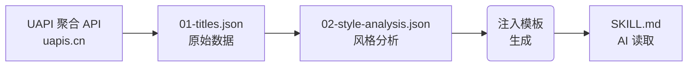

# 黑鸦 · 标题风格生成器

[](LICENSE)
[](https://agentskills.io)
[](https://www.skills.sh/chouchiu/heya.skill)
[](https://skills.sh/chouchiu/heya.skill)


基于 B 站博主 **[黑鸦](https://space.bilibili.com/3706929260006322)**（Heya）视频标题的深度分析，让 AI 学会黑鸦的标志性风格：**长标题、情绪炸弹、多事件合并**。

兼容 [Agent Skills](https://agentskills.io) 协议，支持 Claude Code、Codex、Cursor、OpenClaw、Gemini CLI、OpenCode 等 runtime。

## 特性

通过采集 B 站黑鸦的真实视频标题并进行统计分析，让 AI agent 学会其风格并生成候选标题。

- **数据驱动**：每日自动采集 B 站黑鸦视频标题，统计分析后注入 SKILL.md
- **四种结构**：情感式 / 悬念式 / 日报式 / 对比式，每次生成 3–5 个候选
- **标准协议**：基于 [Agent Skills](https://agentskills.io)，兼容支持该协议的 runtime
- **快速接入**：`npx skills add ChouChiu/heya.skill` 安装后即可使用

## 快速开始

安装后告诉 AI agent 即可使用：

1. 安装 Skill：

   ```bash
   npx skills add ChouChiu/heya.skill
   ```

2. 使用 Skill：
   告诉你的 AI agent：

   ```
   帮我把这段新闻写成黑鸦风格的标题
   ```

3. 获取结果：
   AI 会生成 3-5 个候选标题，覆盖情感式、悬念式、日报式、对比式四种结构。

## 安装

通过 `skills` CLI 安装，适用于所有兼容 Agent Skills 协议的 runtime：

```bash
npx skills add ChouChiu/heya.skill
```

或者告诉你的 AI agent：

```
帮我安装这个 skill：https://github.com/ChouChiu/heya.skill
```

<details>
<summary>其他安装方式</summary>

手动安装：

| Runtime      | 安装路径                                   |
| ------------ | ------------------------------------------ |
| Claude Code  | `~/.claude/skills/heya.skill/`             |
| Codex CLI    | `~/.codex/skills/heya.skill/`              |
| Cursor       | `~/.cursor/skills/heya.skill/`             |
| OpenClaw     | `~/.openclaw/workspace/skills/heya.skill/` |
| 其他 runtime | clone 到对应 runtime 的 `skills/` 目录     |

```bash
git clone https://github.com/ChouChiu/heya.skill <上面对应的路径>
```

直接粘贴：

即使 runtime 不支持自动加载，你也可以直接把 [`SKILL.md`](SKILL.md) 的内容粘贴进对话——它本质就是一份 markdown + YAML frontmatter。

</details>

## 使用

安装完成后，告诉 agent 你要生成黑鸦风格的标题：

```
帮我把这段 AI 新闻写成黑鸦风格的标题
用黑鸦风格给这篇文章起标题
heya style title for this AI news
```

每次生成 3–5 个候选标题，覆盖 **情感式、悬念式、日报式、对比式** 四种结构。

## 效果示例

以下是一个完整的输入输出示例，展示 skill 如何将新闻文稿转化为黑鸦风格标题。

**输入**：
<details><summary>文稿（来自橘鸦 AI 早报）</summary>

```
各位观众早上好
今天是5月23日 周六
欢迎收看AI早报
屏幕上是今天的主要内容
接下来请看详细报道
DeepSeek 宣布将 DeepSeek-V4-Pro 模型 API 现有的 2.5 折优惠转为永久定价
此价格将于原定 5 月 31 日优惠结束后正式生效
智谱发布高速版旗舰模型 GLM-5.1-HighSpeed
官方称在保留原模型能力下速度达 400 tokens/s
目前仅面向部分企业客户开放
阿里宣布旗舰模型 Qwen3.7-Max
已接入千问多端供免费体验
同时有用户发现
阿里云百炼针对该模型提供限时五折优惠
OpenBMB 联合面壁智能与清华大学开源了 BitCPM-CANN 模型系列
官方称
这是首个在华为昇腾 910B 上完成端到端原生训练的 1.58-bit 三值大模型
现已提供 0.5B 至 8B 规模版本
网易有道近期推出了 Confucius4-TTS
能进行14种语言的零样本声音克隆与跨语言合成
据称3秒复刻原声且准确度超97%
模型权重即将发布
Antigravity 发布更新
将Gemini 3.5 Flash最大上下文长度翻倍
付费订阅每周 Gemini 配额提至九倍、并重置了额度
同时
新增IDE打开与安装按钮
修复了Windows故障
支持一键迁移旧设置
CLI推送新版优化体验
Claude Code 的 auto mode 现已面向 Pro 订阅用户开放
并新增对 Sonnet 4.6 和 Opus 4.7 模型的支持
终端工具 Warp 宣布向免费计划用户开放自带模型密钥功能
并全面支持兼容 OpenAI Chat Completions API 的自定义推理端点
TRAE中国版内置的 Kimi-K2.6 和 Kimi-K2.5 模型现已上线原生视频理解能力
可让 Agent 直接看懂并解析视频
Perplexity 宣布开源内部安全工具 Bumblebee
这是一款针对 macOS 和 Linux 开发终端的只读扫描器
已在 GitHub 发布
暂不支持 Windows
Anthropic 公布 Project Glasswing 进展
宣称 Claude Mythos Preview 在关键软件及开源项目中已发现超一万个高危或严重漏洞
Google DeepMind 推出 AlphaProof Nexus 框架
通过结合大型语言模型与 Lean 编译器进行数学形式化证明搜索
相关证明结果及代码已在 GitHub 公开
据报道
有关部门表示
正指导国产大模型适配国产算力芯片
谋划出台加快"人工智能+"落地配套文件
并推动央国企开放高价值应用场景
OpenAI 正在 ChatGPT 网页端测试名为 "Intelligence" 的简化版模型选择器
将原有的模型与推理档位精简为四个选项
官方确认会在全面推出前添加设置
允许用户恢复指定常用的 Pro 选项
据报道
因马斯克等人游说
特朗普在最后一刻取消了原定AI安全行政令签署
相关前沿模型自愿审查机制将重新制定
今天的资讯播送完了，明天见！
```

</details>

**输出**：

<details><summary>V1</summary>

```
基于文稿内容，生成5个黑鸦风格候选标题：

1. 震撼官宣！DeepSeek-V4-Pro永久定价引爆全网！智谱400tokens/s海啸席卷！阿里Qwen3.7-Max免费送！闭源阵营一夜蒸发！| AI日报0523
> 结构：情感式
> 说明：多事件合并（DeepSeek+智谱+阿里），使用"震撼官宣"、"引爆"、"海啸"等情绪词，符合黑鸦最常用的情感式风格

2. AI圈大地震！DeepSeek永久降价杀疯了！华为昇腾首个1.58-bit三值大模型横空出世！Claude Code全面开放！| AI日报0523
> 结构：情感式
> 说明：使用"大地震"、"杀疯了"等强烈情绪词，合并DeepSeek降价+华为昇腾+Claude Code三个重磅事件

3. 见证历史！DeepSeek-V4-Pro永久定价震撼官宣！智谱新模型400tokens/s杀疯了！阿里Qwen3.7-Max免费体验引爆全网！| AI日报0523
> 结构：情感式
> 说明：使用"见证历史"、"震撼官宣"、"杀疯了"、"引爆"等多重情绪词，强化冲击力

4. 后背发凉！Anthropic宣称Claude发现超一万个高危漏洞！特朗普最后一刻取消AI安全令！OpenAI紧急简化模型选择！| AI日报0523
> 结构：悬念式
> 说明：使用"后背发凉"制造悬念，合并Anthropic漏洞+特朗普取消令+OpenAI简化选择器三个事件

5. AI圈全面雪崩！DeepSeek永久定价引爆！智谱400tokens/s海啸！阿里Qwen3.7-Max五折杀疯了！闭源阵营一夜蒸发！| AI日报0523
> 结构：情感式
> 说明：使用"全面雪崩"、"引爆"、"海啸"、"杀疯了"等多重情绪词，强调多事件冲击力

---

**推荐使用第1或第5个**，长度适中（约55字），情绪饱满，多事件合并，最符合黑鸦风格DNA。
```

</details>

<details><summary>V2</summary>

```
1. 震撼官宣！DeepSeek永久降价杀疯了！智谱400 tokens/s海啸席卷！阿里Qwen3.7免费引爆！特朗普紧急取消AI安全令！| AI日报0523
   结构：情感式
   说明：使用"震撼官宣"、"杀疯了"、"海啸"、"引爆"等情绪词，多事件合并，符合黑鸦最常用的情感式风格

2. 后背发凉！DeepSeek永久降价真相？智谱400 tokens/s暗藏杀机，特朗普取消AI安全令，AI圈硝烟弥漫！| AI日报0523
   结构：悬念式
   说明：使用"后背发凉"、"真相？"制造悬念，符合黑鸦的悬念式风格

3. AI圈大地震！DeepSeek永久降价引爆价格战！智谱GLM-5.1-HighSpeed 400 tokens/s海啸来袭！阿里Qwen3.7免费体验杀疯了！| AI日报0523
   结构：情感式
   说明：使用"大地震"、"引爆"、"海啸"、"杀疯了"等情绪词，多事件合并

4. 见证历史！Claude Mythos发现超万漏洞！DeepSeek永久降价！特朗普取消AI安全令，AI安全何去何从？| AI日报0523
   结构：情感式
   说明：使用"见证历史"，聚焦安全主题，多事件合并

5. 重磅炸弹！DeepSeek永久降价！智谱400 tokens/s！阿里Qwen3.7免费！Claude Opus4.7上线！特朗普取消安全令！| AI日报0523
   结构：情感式
   说明：使用"重磅炸弹"，多事件罗列，冲击力强
```

</details>

## 常见问题

以下是使用本 skill 时的常见问题。

### Q: 支持哪些 AI agent？

A: 支持所有兼容 [Agent Skills](https://agentskills.io) 协议的 runtime，包括 Claude Code、Codex、Cursor、OpenClaw、Gemini CLI、OpenCode 等。

### Q: 安装后如何使用？

A: 直接告诉你的 AI agent "用黑鸦风格给这段内容起标题"，它会自动加载 Skill 并生成 3-5 个候选标题。

### Q: 标题效果不好怎么办？

A: 可以尝试：

1. 提供更详细的内容素材
2. 指定想要的情感强度（强烈/中等/轻微）
3. 要求特定结构（情感式/悬念式/日报式/对比式）

### Q: 如何更新数据分析？

A: 运行 `bun pipeline` 命令，它会自动采集最新视频标题并更新分析数据。

### Q: 可以用于非 AI 领域的内容吗？

A: 可以！黑鸦风格适用于任何需要吸引眼球的内容，包括科技、游戏、娱乐、体育等领域。

## 工作原理

数据 pipeline 分三步将原始视频标题转化为 AI agent 可用的风格指南：



| 步骤    | 说明                                                                  |
| ------- | --------------------------------------------------------------------- |
| 1. 采集 | 通过 UAPI 聚合 API (uapis.cn) 获取黑鸦视频标题             |
| 2. 分析 | 统计标题长度分布、情绪词频、结构占比、高频词汇                        |
| 3. 生成 | 将分析结果注入 [`SKILL.md`](SKILL.md)，形成 AI agent 可读取的风格指南 |

```bash
bun pipeline              # 全流程：采集 → 分析 → 生成
bun pipeline --skip-fetch # 跳过采集，仅分析 + 生成
```

## 本地开发

本地运行数据 pipeline 或修改 skill 代码：

> 前置要求：[Bun](https://bun.sh) ≥ 1.0

```bash
# 克隆项目
git clone https://github.com/ChouChiu/heya.skill
cd heya.skill

# 安装依赖
bun install

# 配置 Cookie（可选，不配也能跑但可能遇到风控）
cp .env.example .env
# 编辑 .env，填入 B站 Cookie（见下方说明）

# 运行
bun pipeline

# 更多选项
bun pipeline --dry-run      # 预览步骤
bun pipeline --skip-analyze # 跳过分析，仅重新生成 SKILL.md
bun run scripts/analyze-titles.ts --top 30 # 调整分析样本量

# 代码质量
bun run lint       # Biome 检查
bun run format     # Biome 自动修复
```

### 环境变量（可选）

采集脚本通过 UAPI 聚合 API (uapis.cn) 获取视频数据，无需配置即可运行。如需更高配额，可设置 API Key：

```bash
UAPI_API_KEY=<你的 UAPI API Key>
```

### CI 配置（GitHub Actions）

每日自动更新由 [`.github/workflows/update-reference.yml`](.github/workflows/update-reference.yml) 执行，无需额外配置。

## 项目结构

仓库包含两个独立子项目：数据 pipeline 脚本和 Astro 落地页。

```
heya.skill/
├── SKILL.md                 # 生成产物：Agent Skills 入口（AI 读取）
├── SKILL.example.md         # ✏️ 模板源文件（手动编辑这个）
├── scripts/
│   ├── pipeline.ts          # 全流程编排：采集 → 分析 → 生成
│   ├── fetch-bilibili-titles.ts  # 采集脚本
│   ├── analyze-titles.ts    # 分析脚本
│   ├── update-skill.ts      # 生成脚本
│   └── lib/                 # 共享模块（分析引擎、分词、生成器）
│       ├── uapi.ts          # UAPI 聚合 API 客户端
│       ├── analysis/        # 分析引擎
│       └── generate/        # 生成器
├── references/
│   └── research/            # 分析数据（JSON + MD 双格式）
├── website/                 # Astro 落地页（独立项目）
└── .github/
    └── workflows/           # CI：每日自动更新 + 网站部署
```

## 相关链接

- [Agent Skills 协议](https://agentskills.io) — 本项目遵循的开放 AI Skill 标准
- [skills.sh 市场页面](https://skills.sh/chouchiu/heya.skill) — 本项目的 Skill 下载页
- [黑鸦 B 站主页](https://space.bilibili.com/3706929260006322) — 标题风格的原始来源

## 贡献指南

欢迎各种形式的贡献，包括代码、文档、问题报告和功能建议。

请阅读 [贡献指南](CONTRIBUTING.md) 了解详细的贡献流程。

本项目采用 [贡献者公约](CODE_OF_CONDUCT.md)，参与即表示同意遵守该准则。

## 许可证

本项目采用 [MIT](LICENSE) 许可证。
